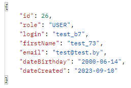
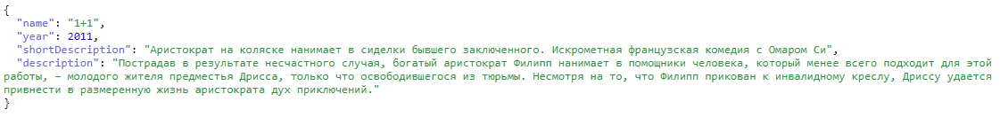

 

<h3 align="center">Cinema</h3>

  

   Vitality Medvedev’s study project!
     
    <a <strong>Sample application for buy cinema tickets</strong></a>

  

## About The Project

Service for the purchase of tickets. To use the service, the user must register on the platform. Then, after selecting the desired movie and session, the user can purchase tickets. The service allows you to buy or hand over the beatets, as well as edit your data.

The project developed gradually over four months of training:
* First month - web servlet application
* Second month - Hibernate, Hibernate query language, Criteria API.
* The third month is a gradual transition to spring.
* Month four - Spring Boot, Spring Data JPA, JUnit 5, Spring Cloud

## Road map

- [x] Spring Boot
- [x] Spring Data JPA
- [x] CRUD service for entities
- [x] Cloud application configuration
- [x] Remote API for getting information about the film from "Kinopoisk.ru"
- [x] Test for service

# Examples

Endpoint for user registration:

POST http://localhost:8081/api/v1/user

JSON body:

{"login": "test_b7",
"password": "123456",
"firstName": "test_73",
"email": "test@test.by",
"dateBirthday": "2000-06-14"}

Response:

Endpoint for information about the film from "Kinopoisk.ru":

GET http://localhost:8081/api/v1/movieInfo/535341

Response:

